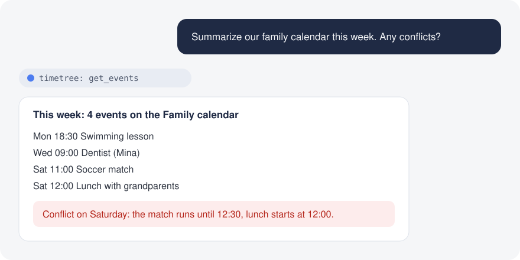

<p align="center">
  
</p>

<h1 align="center">TimeTree MCP</h1>

<p align="center">
  Claude、Codex、Cursor などの MCP クライアントから TimeTree カレンダーと会話できます。
</p>

<p align="center">
  <a href="https://github.com/ehs208/TimeTree-MCP/actions/workflows/ci.yml"></a>
  <a href="https://github.com/ehs208/TimeTree-MCP/releases/latest"></a>
  <a href="LICENSE"></a>
</p>

<p align="center">
  <a href="README.md">English</a> | <a href="README.ko.md">한국어</a> | 日本語
</p>

> [!NOTE]
> 個人利用向けの非公式プロジェクトです。TimeTree, Inc. とは関係ありません。TimeTree Web アプリの非公開エンドポイントを使うため、いつでも動作が変わる可能性があります。詳細は [DISCLAIMER.md](DISCLAIMER.md) を参照してください。

AI アシスタントに次のように聞くだけです。

- 「今週の家族カレンダーをまとめて。予定の重なりはある？」
- 「最後に歯医者に行ったのはいつ？」
- 「土曜の 19 時に家族カレンダーへ夕食の予定を追加して。」
- 「この旅行プランを予定と持ち物メモにして。」
- 「今日カレンダーを変更したのは誰？何を変えた？」

<p align="center">
  
</p>

## できること

- **カレンダーを読む。** 日付、キーワード、ラベルで予定を絞り込み、繰り返し予定は実際の日付に展開します。
- **頼めば変更する。** 予定、メモ、コメントの作成、更新、削除と、ラベル名や色の変更ができます。
- **変更を把握する。** ある時点以降に変わった予定と、最近だれが何を変えたかを確認できます。
- **文脈がわかる。** カレンダーのメンバーと国ごとの祝日を取得します。
- **自分のパソコンで動く。** メールアドレスとパスワードは TimeTree にだけ送信し、セッションはメモリにだけ保持します。

## インストール

### Claude Desktop（macOS、Windows）: ワンクリック拡張機能

1. [最新リリース](https://github.com/ehs208/TimeTree-MCP/releases/latest)から `timetree-mcp-<バージョン>.mcpb` をダウンロードします。
2. ファイルを開きます。Claude Desktop にインストール画面が表示されます。
3. TimeTree のメールアドレスとパスワードを入力し、拡張機能を有効にします。

Git や Node.js のインストール、設定ファイルの編集は不要です。macOS と Windows の Claude Desktop に含まれる Node.js で動作します。

### Claude Code、Codex、Cursor などのクライアント

Node.js 22 以上と Git が必要です。

**コーディングエージェントに任せる。** Claude Code、Codex などのエージェントに次の内容を貼り付けます。

> Clone `https://github.com/ehs208/TimeTree-MCP`, enter the cloned directory, run `npm ci && npm run build`, then configure my MCP client with a server named `timetree` that runs `node /absolute/path/to/TimeTree-MCP/dist/index.js` (use the real cloned path). Store `TIMETREE_EMAIL` and `TIMETREE_PASSWORD` only in the MCP client environment configuration, and never hardcode or print secrets.

**インストーラーを実行する。** clone とビルドを行い、クライアントごとの設定例を表示します。

```bash
curl -fsSL https://raw.githubusercontent.com/ehs208/TimeTree-MCP/main/TimeTree-MCP-install.sh | bash
```

<details>
<summary>手動インストール</summary>

```bash
git clone https://github.com/ehs208/TimeTree-MCP.git
cd TimeTree-MCP
npm ci
npm run build
```

次に MCP クライアントへサーバーを追加します。macOS の Claude Desktop の例です（`~/Library/Application Support/Claude/claude_desktop_config.json`）。

```json
{
  "mcpServers": {
    "timetree": {
      "command": "node",
      "args": ["/absolute/path/to/TimeTree-MCP/dist/index.js"],
      "env": {
        "TIMETREE_EMAIL": "your-email@example.com",
        "TIMETREE_PASSWORD": "your-password"
      }
    }
  }
}
```

GUI クライアントが `node` を見つけられない場合は、`command -v node` で表示される絶対パスを `command` に指定します。

</details>

クライアントごとの設定（Claude Code、Codex、Cursor、Windsurf、VS Code、Antigravity など）: [docs/MCP_CLIENTS.md](docs/MCP_CLIENTS.md)

このプロジェクトは npm で公開していません。GitHub リリースか、このリポジトリの clone からインストールします。

## 更新

新しいバージョンが出ると、サーバーがツールの応答に一度だけお知らせを追加し、アシスタントから伝えられるようにします。無効にするには MCP の `env` に `TIMETREE_UPDATE_CHECK=false` を設定します。

- **Claude Desktop 拡張機能:** [最新リリース](https://github.com/ehs208/TimeTree-MCP/releases/latest)から新しい `.mcpb` をダウンロードして開きます。
- **Git clone:** インストールフォルダで `git pull origin main && npm ci && npm run build` を実行し、MCP クライアントを再起動します。

詳しい手順: [docs/UPDATING.md](docs/UPDATING.md)。変更履歴: [CHANGELOG.md](CHANGELOG.md)。

## ツール

| 分類 | ツール |
|---|---|
| カレンダー | `list_calendars` |
| 予定 | `get_events`, `get_updated_events`, `create_event`, `update_event`, `delete_event` |
| メモ | `list_memos`, `create_memo`, `update_memo`, `delete_memo` |
| コメント | `list_event_comments`, `add_event_comment`, `update_event_comment`, `delete_event_comment` |
| ラベルとメンバー | `get_calendar_labels`, `update_calendar_labels`, `get_calendar_members`, `get_calendar_virtual_members` |
| その他 | `get_holidays`, `get_recent_activity` |

パラメータと使用例: [COMMANDS.md](COMMANDS.md)

## プライバシーとセキュリティ

- メールアドレスとパスワードは MCP クライアントの設定、または Claude Desktop 拡張機能の設定にだけ保存され、TimeTree にだけ送信されます。
- セッション Cookie と CSRF トークンはメモリにだけ保持し、ディスクには書き込みません。
- ログではパスワード、Cookie、トークンをマスクします。
- 起動時に新しいバージョンを確認するため GitHub に 1 回リクエストを送ります。認証情報やカレンダーデータは送信しません。

## トラブルシューティング

**"Missing required environment variables"**: MCP 設定に `TIMETREE_EMAIL` と `TIMETREE_PASSWORD` を設定します。Claude Desktop 拡張機能の場合は、設定を開いて入力し直します。

**ログインに失敗する**: 同じメールアドレスとパスワードで TimeTree Web アプリにログインできるか確認します。このサーバーはメールアドレスとパスワードでのログインのみ対応しています。

**カレンダーや予定が表示されない**: アカウントにカレンダーがあるか確認し、クライアントの MCP ログを見てください。TimeTree の Web API が変わった可能性があるため、[Issue](https://github.com/ehs208/TimeTree-MCP/issues) で知らせてください。

## 仕組み

サーバーはメールアドレスとパスワードで TimeTree Web アプリにログインし、Web アプリと同じエンドポイントを呼び出します。セッションが切れると再ログインし、リクエストは毎秒 10 回までに制限して HTTP 429 では再試行します。予定の多いカレンダーもすべてのページを読み込みます。

書き込みリクエストには CSRF トークンが必要で、サーバーがログイン後に TimeTree の Web ページから取得します。

## コントリビュート

Issue と Pull Request を歓迎します。[CONTRIBUTING.md](CONTRIBUTING.md) を参照してください。

## クレジット

[@eoleedi](https://github.com/eoleedi) による [TimeTree-Exporter](https://github.com/eoleedi/TimeTree-Exporter) の API に関する知見を参考にしています。

## ライセンス

MIT。[LICENSE](LICENSE) を参照してください。TimeTree, Inc. とは関係ありません。[DISCLAIMER.md](DISCLAIMER.md) を参照してください。
