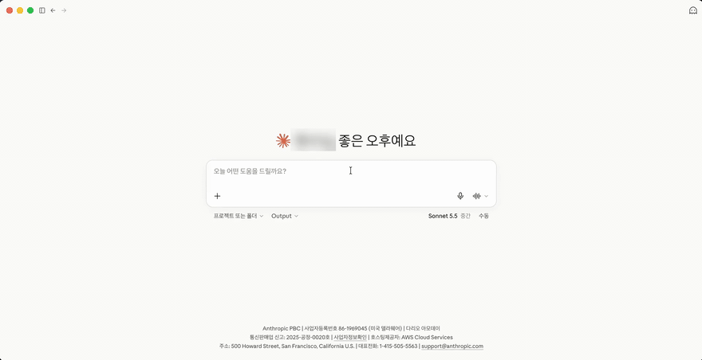

<p align="center">
  
</p>

<h1 align="center">TimeTree MCP</h1>

<p align="center">
  Claude, Codex, Cursor 같은 MCP 클라이언트에서 TimeTree 캘린더와 대화합니다.
</p>

<p align="center">
  <a href="https://github.com/ehs208/TimeTree-MCP/actions/workflows/ci.yml"></a>
  <a href="https://github.com/ehs208/TimeTree-MCP/releases/latest"></a>
  <a href="LICENSE"></a>
</p>

<p align="center">
  <a href="README.md">English</a> | 한국어 | <a href="README.ja.md">日本語</a>
</p>

> [!NOTE]
> 개인 사용을 위한 비공식 프로젝트입니다. TimeTree, Inc.와 관계가 없습니다. TimeTree 웹 앱의 비공개 엔드포인트를 사용하므로 언제든 동작이 바뀔 수 있습니다. 자세한 내용은 [DISCLAIMER.md](DISCLAIMER.md)를 참고하십시오.

AI 어시스턴트에게 이렇게 물어보면 됩니다.

- "이번 주 가족 캘린더 정리해줘. 겹치는 일정 있어?"
- "마지막으로 치과 간 게 언제였지?"
- "토요일 저녁 7시에 가족 캘린더에 저녁 약속 추가해줘."
- "이 여행 계획을 일정이랑 준비물 메모로 만들어줘."
- "오늘 누가 캘린더에서 뭘 바꿨어?"

<p align="center">
  
</p>

## 할 수 있는 일

- **캘린더를 읽습니다.** 날짜, 키워드, 라벨로 일정을 거르고, 반복 일정은 실제 날짜로 펼쳐서 보여줍니다.
- **요청하면 바꿉니다.** 일정, 메모, 댓글을 만들고 고치고 지우며, 라벨 이름과 색도 바꿉니다.
- **변경 사항을 알려줍니다.** 특정 시점 이후 바뀐 일정과 최근에 누가 무엇을 바꿨는지 확인합니다.
- **맥락을 압니다.** 캘린더 멤버와 국가별 공휴일을 조회합니다.
- **내 컴퓨터에서 실행됩니다.** 이메일과 비밀번호는 TimeTree에만 전송하고, 세션은 메모리에만 둡니다.

## 설치

### Claude Desktop (macOS, Windows): 원클릭 확장 프로그램

1. [최신 릴리스](https://github.com/ehs208/TimeTree-MCP/releases/latest)에서 `timetree-mcp-<버전>.mcpb`를 내려받습니다.
2. 파일을 엽니다. Claude Desktop에 설치 창이 뜹니다.
3. TimeTree 이메일과 비밀번호를 입력하고 확장 프로그램을 켭니다.

Git, Node.js 설치나 설정 파일 편집이 필요 없습니다. macOS와 Windows용 Claude Desktop에 들어 있는 Node.js로 실행됩니다.

### Claude Code, Codex, Cursor 등 다른 클라이언트

Node.js 22 이상과 Git이 필요합니다.

**코딩 에이전트에게 맡기기.** Claude Code, Codex 같은 에이전트에 아래 내용을 붙여넣습니다.

> `https://github.com/ehs208/TimeTree-MCP`를 클론하고, 클론한 디렉토리 안에서 `npm ci && npm run build`를 실행한 뒤, 내 MCP 클라이언트에 `timetree` 서버를 추가해줘. 실행 명령은 `node /absolute/path/to/TimeTree-MCP/dist/index.js` 형태로 실제 clone 경로를 사용하고, `TIMETREE_EMAIL`과 `TIMETREE_PASSWORD`는 MCP 클라이언트의 환경변수 설정에만 저장하며 절대 코드나 로그에 직접 쓰지 마.

**설치 스크립트 실행.** 클론과 빌드를 하고 클라이언트별 설정 예시를 출력합니다.

```bash
curl -fsSL https://raw.githubusercontent.com/ehs208/TimeTree-MCP/main/TimeTree-MCP-install.sh | bash
```

<details>
<summary>수동 설치</summary>

```bash
git clone https://github.com/ehs208/TimeTree-MCP.git
cd TimeTree-MCP
npm ci
npm run build
```

그다음 MCP 클라이언트에 서버를 추가합니다. macOS의 Claude Desktop 예시입니다(`~/Library/Application Support/Claude/claude_desktop_config.json`).

```json
{
  "mcpServers": {
    "timetree": {
      "command": "node",
      "args": ["/absolute/path/to/TimeTree-MCP/dist/index.js"],
      "env": {
        "TIMETREE_EMAIL": "your-email@example.com",
        "TIMETREE_PASSWORD": "your-password"
      }
    }
  }
}
```

GUI 클라이언트가 `node`를 찾지 못하면 `command -v node`로 나온 절대 경로를 `command`에 넣습니다.

</details>

클라이언트별 설정(Claude Code, Codex, Cursor, Windsurf, VS Code, Antigravity 등): [docs/MCP_CLIENTS.md](docs/MCP_CLIENTS.md)

이 프로젝트는 npm에 배포하지 않습니다. GitHub 릴리스나 이 레포 clone으로 설치합니다.

## 업데이트

새 버전이 나오면 서버가 툴 응답에 안내를 한 번 덧붙여서 어시스턴트가 알려줄 수 있게 합니다. 끄려면 MCP `env`에 `TIMETREE_UPDATE_CHECK=false`를 설정합니다.

- **Claude Desktop 확장 프로그램:** [최신 릴리스](https://github.com/ehs208/TimeTree-MCP/releases/latest)에서 새 `.mcpb`를 내려받아 엽니다.
- **Git clone:** 설치 폴더에서 `git pull origin main && npm ci && npm run build`를 실행하고 MCP 클라이언트를 재시작합니다.

자세한 방법: [docs/UPDATING.md](docs/UPDATING.md). 변경 내역: [CHANGELOG.md](CHANGELOG.md).

## 툴

| 영역 | 툴 |
|---|---|
| 캘린더 | `list_calendars` |
| 일정 | `get_events`, `get_updated_events`, `create_event`, `update_event`, `delete_event` |
| 메모 | `list_memos`, `create_memo`, `update_memo`, `delete_memo` |
| 댓글 | `list_event_comments`, `add_event_comment`, `update_event_comment`, `delete_event_comment` |
| 라벨과 멤버 | `get_calendar_labels`, `update_calendar_labels`, `get_calendar_members`, `get_calendar_virtual_members` |
| 기타 | `get_holidays`, `get_recent_activity` |

파라미터와 사용 예시: [COMMANDS.md](COMMANDS.md)

## 개인정보와 보안

- 이메일과 비밀번호는 MCP 클라이언트 설정이나 Claude Desktop 확장 프로그램 설정에만 저장되고, TimeTree에만 전송됩니다.
- 세션 쿠키와 CSRF 토큰은 메모리에만 두고 디스크에 쓰지 않습니다.
- 로그에서 비밀번호, 쿠키, 토큰을 가립니다.
- 서버가 시작할 때 새 버전 확인을 위해 GitHub에 한 번 요청합니다. 인증 정보나 캘린더 데이터는 보내지 않습니다.

## 문제 해결

**"Missing required environment variables"**: MCP 설정에 `TIMETREE_EMAIL`과 `TIMETREE_PASSWORD`를 넣습니다. Claude Desktop 확장 프로그램이라면 설정을 열어 다시 입력합니다.

**로그인 실패**: 같은 이메일과 비밀번호로 TimeTree 웹 앱에 로그인되는지 확인합니다. 이 서버는 이메일과 비밀번호 로그인만 지원합니다.

**캘린더나 일정이 안 나옴**: 계정에 캘린더가 있는지 확인하고 클라이언트의 MCP 로그를 봅니다. TimeTree 웹 API가 바뀌었을 수 있으니 [이슈](https://github.com/ehs208/TimeTree-MCP/issues)로 알려주십시오.

## 동작 방식

서버는 이메일과 비밀번호로 TimeTree 웹 앱에 로그인한 뒤, 웹 앱이 쓰는 엔드포인트를 그대로 호출합니다. 세션이 만료되면 다시 로그인하고, 요청은 초당 10회로 제한하며 HTTP 429에는 재시도합니다. 일정이 많은 캘린더도 모든 페이지를 읽습니다.

쓰기 요청에는 CSRF 토큰이 필요하며, 서버가 로그인 후 TimeTree 웹 페이지에서 읽어옵니다.

## 기여

이슈와 PR을 환영합니다. [CONTRIBUTING.md](CONTRIBUTING.md)를 참고하십시오.

## 크레딧

[@eoleedi](https://github.com/eoleedi)의 [TimeTree-Exporter](https://github.com/eoleedi/TimeTree-Exporter)에서 API 분석 결과를 참고했습니다.

## 라이선스

MIT. [LICENSE](LICENSE)를 참고하십시오. TimeTree, Inc.와 관계가 없습니다. [DISCLAIMER.md](DISCLAIMER.md)를 참고하십시오.
