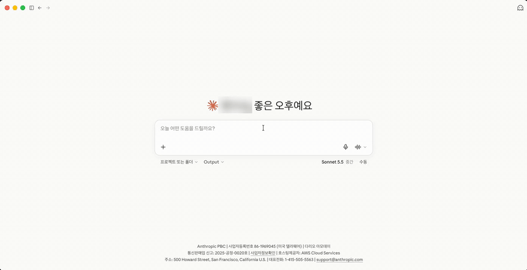

<p align="center">
  
</p>

<h1 align="center">TimeTree MCP</h1>

<p align="center">
  Talk to your TimeTree calendar from Claude, Codex, Cursor, and other MCP clients.
</p>

<p align="center">
  <a href="https://github.com/ehs208/TimeTree-MCP/actions/workflows/ci.yml"></a>
  <a href="https://github.com/ehs208/TimeTree-MCP/releases/latest"></a>
  <a href="LICENSE"></a>
</p>

<p align="center">
  English | <a href="README.ko.md">한국어</a> | <a href="README.ja.md">日本語</a>
</p>

> [!NOTE]
> Unofficial and for personal use. Not affiliated with TimeTree, Inc. It uses the TimeTree web app's undocumented endpoints, which can change at any time. See [DISCLAIMER.md](DISCLAIMER.md).

Ask your AI assistant things like:

- "Summarize our family calendar this week. Any conflicts?"
- "When was the last dentist appointment?"
- "Add a dinner on Saturday at 7 pm to the Family calendar."
- "Turn this trip plan into events and a packing memo."
- "Who changed the calendar today, and what did they change?"

<p align="center">
  
</p>

## What it does

- **Reads your calendars.** Events with date, keyword, and label filters. Recurring events are expanded into their actual dates.
- **Changes them when you ask.** Create, update, and delete events, memos, and comments, and rename or recolor labels.
- **Keeps you up to date.** See what changed since a given time, and who made recent changes.
- **Knows the context.** Calendar members and public holidays by country.
- **Runs on your computer.** Your email and password are sent only to TimeTree. The session stays in memory.

## Install

### Claude Desktop (macOS, Windows): one-click extension

1. Download `timetree-mcp-<version>.mcpb` from the [latest release](https://github.com/ehs208/TimeTree-MCP/releases/latest).
2. Open the file. Claude Desktop shows an install dialog.
3. Enter your TimeTree email and password, then enable the extension.

No Git, Node.js install, or config file editing is needed. The extension runs on the Node.js that comes with Claude Desktop on macOS and Windows.

### Claude Code, Codex, Cursor, and other clients

Requires Node.js 22 or later and Git.

**Ask your coding agent.** Paste this into Claude Code, Codex, or a similar agent:

> Clone `https://github.com/ehs208/TimeTree-MCP`, enter the cloned directory, run `npm ci && npm run build`, then configure my MCP client with a server named `timetree` that runs `node /absolute/path/to/TimeTree-MCP/dist/index.js` (use the real cloned path). Store `TIMETREE_EMAIL` and `TIMETREE_PASSWORD` only in the MCP client environment configuration, and never hardcode or print secrets.

**Or run the installer.** It clones, builds, and prints a config example for each client:

```bash
curl -fsSL https://raw.githubusercontent.com/ehs208/TimeTree-MCP/main/TimeTree-MCP-install.sh | bash
```

<details>
<summary>Manual install</summary>

```bash
git clone https://github.com/ehs208/TimeTree-MCP.git
cd TimeTree-MCP
npm ci
npm run build
```

Then add the server to your MCP client. Example for Claude Desktop on macOS (`~/Library/Application Support/Claude/claude_desktop_config.json`):

```json
{
  "mcpServers": {
    "timetree": {
      "command": "node",
      "args": ["/absolute/path/to/TimeTree-MCP/dist/index.js"],
      "env": {
        "TIMETREE_EMAIL": "your-email@example.com",
        "TIMETREE_PASSWORD": "your-password"
      }
    }
  }
}
```

If a GUI client cannot find `node`, use the absolute path from `command -v node` as `command`.

</details>

Setup for each client (Claude Code, Codex, Cursor, Windsurf, VS Code, Antigravity, and more): [docs/MCP_CLIENTS.md](docs/MCP_CLIENTS.md)

This project is not published to npm. Install it from a GitHub release or a clone of this repository.

## Updating

When a newer version is out, the server adds a one-time notice to a tool response, so your assistant can tell you. Set `TIMETREE_UPDATE_CHECK=false` in the MCP `env` to turn this off.

- **Claude Desktop extension:** download the new `.mcpb` from the [latest release](https://github.com/ehs208/TimeTree-MCP/releases/latest) and open it.
- **Git clone:** run `git pull origin main && npm ci && npm run build` in the folder, then restart your MCP client.

Details: [docs/UPDATING.md](docs/UPDATING.md). Changes: [CHANGELOG.md](CHANGELOG.md).

## Tools

| Area | Tools |
|---|---|
| Calendars | `list_calendars`, `create_calendar` |
| Events | `get_events`, `get_updated_events`, `create_event`, `update_event`, `delete_event` |
| Memos | `list_memos`, `create_memo`, `update_memo`, `delete_memo` |
| Comments | `list_event_comments`, `add_event_comment`, `update_event_comment`, `delete_event_comment` |
| Labels and members | `get_calendar_labels`, `update_calendar_labels`, `get_calendar_members`, `get_calendar_virtual_members` |
| Other | `get_holidays`, `get_recent_activity` |

Parameters and examples: [COMMANDS.md](COMMANDS.md)

`create_calendar` requires a name (1–20 characters) and an explicit purpose. It does not invite members. Timeouts and server errors are not retried.
If the creation response cannot be validated, check existing calendars before trying again.

## Privacy and security

- Your email and password are stored only in your MCP client configuration, or in Claude Desktop's extension settings. They are sent only to TimeTree.
- Session cookies and CSRF tokens stay in memory and are never written to disk.
- Logs mask passwords, cookies, and tokens.
- On startup, the server makes one request to GitHub to check for a newer version. No credentials or calendar data are sent.

## Troubleshooting

**"Missing required environment variables"**: set `TIMETREE_EMAIL` and `TIMETREE_PASSWORD` in your MCP configuration. For the Claude Desktop extension, open its settings and enter them again.

**Sign-in fails**: check that you can sign in on the TimeTree web app with the same email and password. The server signs in with email and password only.

**No calendars or events**: make sure the account has calendars, and check the client's MCP logs. TimeTree may have changed its web API; please [open an issue](https://github.com/ehs208/TimeTree-MCP/issues).

## How it works

The server signs in to the TimeTree web app with your email and password, then calls the same endpoints the web app uses. It signs in again when the session expires, limits requests to 10 per second with retries on HTTP 429, and reads every page of large calendars.

Write requests need a CSRF token, which the server reads from the TimeTree web page after signing in.

## Contributing

Issues and pull requests are welcome. See [CONTRIBUTING.md](CONTRIBUTING.md).

## Credits

API insights from [TimeTree-Exporter](https://github.com/eoleedi/TimeTree-Exporter) by [@eoleedi](https://github.com/eoleedi).

## License

MIT. See [LICENSE](LICENSE). Not affiliated with TimeTree, Inc. See [DISCLAIMER.md](DISCLAIMER.md).
